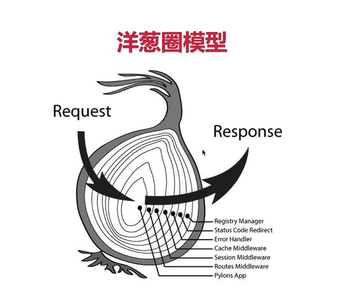

# Koa2
## 简介
- express原班人马打造
- koa使用的 * + yied 来控制异步的，不好用；koa2使用async + await进行改进。
- 安装：
  - 1. 安装脚手架`koa-generator`
  - 2. 执行命令创建koa2项目`koa2 project-name`，记得是`koa2`

## 相对于express的进步：
- koa2原生支持async/await，异步回调更加舒畅

## 登录session：
- 使用koa-redis && koa-generic-session

## Koa2 中间件
- 使用app.use注册中间件，逻辑跟express一样的。
- 需要注意的一点是，koa2的每个中间件都是一个async函数（返回一个Promise），能够像写同步代码一样，用await来hold中间件的使用。
- 原理：洋葱圈模型
  - 
  - 步骤分析：
    - app.use收集注册的中间件（因为router功能的分离，所以不涉及get，post的分类）
    - 实现next机制