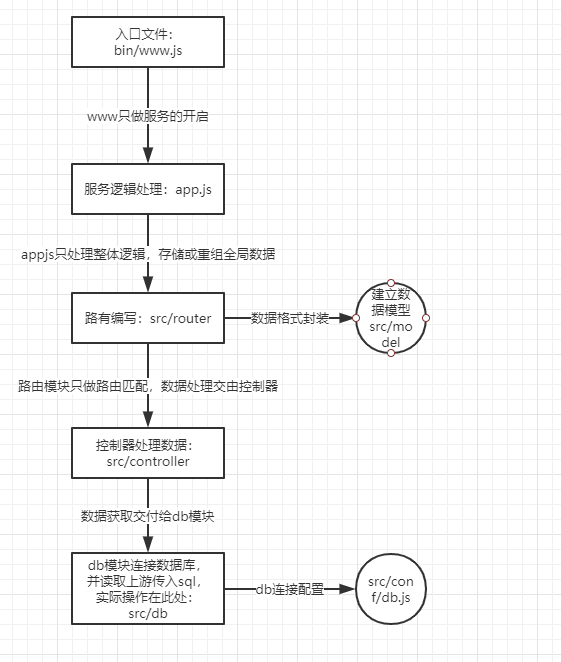

# 流程解释

# Server Dev
- 服务稳定性
    - server的恶意攻击与误操作
    - 单个客户端可以挂掉，服务端不行
    - PM2进程守候保证稳定性
- 考虑内存与CPU(优化与扩展)
    - 客户端独占浏览器，内存与CPU不是问题
    - server端承载很多请求，CPU与内存是稀缺资源
- 日志与记录
    - server端要记录，存储，分析日志才能够得到服务的详情数据
- 安全
    - server端随时准备接收各种恶意攻击（接口暴露外网）如，越权操作，数据库攻击
    - 预防XSS攻击与Sql注入
- 集群与服务拆分
    - 产品发展快，流量激增-->扩展机器与服务拆分来承载更多流量
