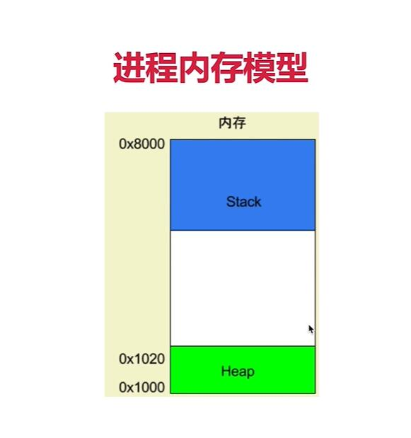
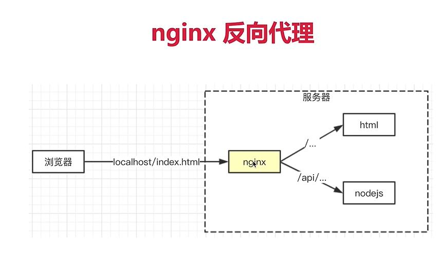

# NodeJS处理http：
- get && queryString
- post && postData
- 路由

# 开发环境热更新nodemon搭配cross-env
- cross-env NODE_ENV=dev 设置变量NODE_ENV，来标志开发环境
- nodemon xxx.js热更新状态运行

# 目录：
- `./bin/www.js`：程序入口文件
- `app.js`：业务逻辑入口
- src：详细业务逻辑
    - router：路由处理
    - model：数据模型定义
    - controller：数据处理

# 路由 && API：
- API：
    - 前后端，不同端，不同子系统之间进行对接的一个术语
    - 包括url（路由）`/api/user/login`、输入、输出
    - 后端实现，前端黑盒

- 路由：
    - API的一部分
    - 后端系统内部的一个定义（router）

# 接口开发API：
- 原则：将路由和数据处理分离
- 登录：
    - 核心：登录效验，登录信息存储
    - 每次发送http请求，都会将请求域的cookie一起发给server，server可以修改cookie并返回给浏览器
    - cookie：
        - 存储在浏览器的一段字符串（maximum 5kb）
        - 跨域不共享
        - 稳定格式：k1=v1;k2=v2...
        - 每次发送http请求，都会将该请求域的cookie一起发送给server端（发送的是当前请求域的，如在taobao.com请求baidu的服务器，则会将baidu.com下的cookie发送过去，而不是看在哪个网页发送的请求）
        - server端可以修改cookie，并返回给浏览器
        - 浏览器也能通过JavaScript来修改cookie（但有限制）
    - cookie的问题：
        - 会暴露出username等用户私人信息，很危险。
        - 只有5kb大小，容量小。
        - 解决：cookie存储userId，用作标识，在server端则对应着username --> 使用session，即server端存储用户信息
    - session：
        - nodeJS进程服务存储session问题：
            - 进程内存有限，访问量过大，内存将暴增导致进程崩溃
            - 
            - 正式上线是多进程，进程间内存无法共享
            - 重启服务，将丢失session数据
        - 解决：使用内存数据库（如redis）
            - Redis：
                - 常用缓存数据库，数据存储在内存中
                - 访问速度块（内存数据库）
                - 成本高，存储量小
                - 关机就没了
            - 为什么用redis：
                - session访问频繁，对性能要求高
                - session可以不去考虑断电丢失数据的问题，所以可以使用内存数据库
                - session数据量较小，对数据库容量大小要求小

# 前后端联调
- nginx反向代理（让前端与server端同域）
    - 开源免费，高性能web服务器
    - 一般用于做静态服务、负载均衡
    - 反向代理
        - 

# 日志
- 系统没有日志，等于人没眼睛
- 使用文件操作（NodeJS stream），将日志存储在文件中
    - 为什么不存储在Redis中
        - 日志非常大，放在redis中代价高
        - 日志对性能要求低
    - 为什么不放在MySQL中
        - MySQL主要用于结构化数据，日志不一定是结构化的数据
        - 日志可能需要常常拷贝到其他地方，文件形式更加灵活方便
        - 日志对性能要求不高
    - IO的性能瓶颈
        - IO包括“网络IO”与“文件IO”
        - 相比于CUP计算与内存读写，IO特点就是“慢”
        - 在有限的硬件资源下提升IO操作效率？
            - 
- 日志拆分
    - 按时间划分如2020-06-08.access.log
    - linux的cronatb定时任务
- 日志内容分析
    - 使用readline（基于stream），来一行一行读取日志
- 1、访问日志access log（每次的http请求访问都将记录下来）
- 2、自定义日志（自定义事件、错误记录等）


# 安全：
- sql注入：窃取数据库内容
    - 最原始、简单的攻击：输入一个sql片段，最终拼接成一段攻击代码
        - 如登录时username输入`xzxldl'; -- `，这样在执行sql时，将被拼接为：如此，后面对password的验证就被注释掉了，攻击者不需要密码就能随意登录他人的账号。
        ```
          select * 
          from user 
          where username='xzxldl'; -- ' password=随便输个密码
        ```
        更严重的，在`;`后面加点毁灭性代码`delete xxx`
    - 预防：使用MySQL的escape函数处理输入内容，在所有能拼接SQL语句的地方都需要使用escape
- XSS攻击：窃取前端cookie内容
    - 方式：在页面展示内容中掺杂JS代码，以获取网页信息
        - 如：在写帖子时，写入`<script>alert(document.cookie)</scritp>`
    - 预防措施：转换生成JS的特殊字符
        - 
        - 使用xss工具自动帮我们转译这些特殊字符
- 密码加密
    - 用户密码加密，将加密后的数据存入数据库


# Server Dev
- 服务稳定性
    - server的恶意攻击与误操作
    - 单个客户端可以挂掉，服务端不行
    - PM2进程守候保证稳定性
- 考虑内存与CPU(优化与扩展)
    - 客户端独占浏览器，内存与CPU不是问题
    - server端承载很多请求，CPU与内存是稀缺资源
- 日志与记录
    - server端要记录，存储，分析日志才能够得到服务的详情数据
- 安全
    - server端随时准备接收各种恶意攻击（接口暴露外网）如，越权操作，数据库攻击
    - 预防XSS攻击与Sql注入
- 集群与服务拆分
    - 产品发展快，流量激增-->扩展机器与服务拆分来承载更多流量